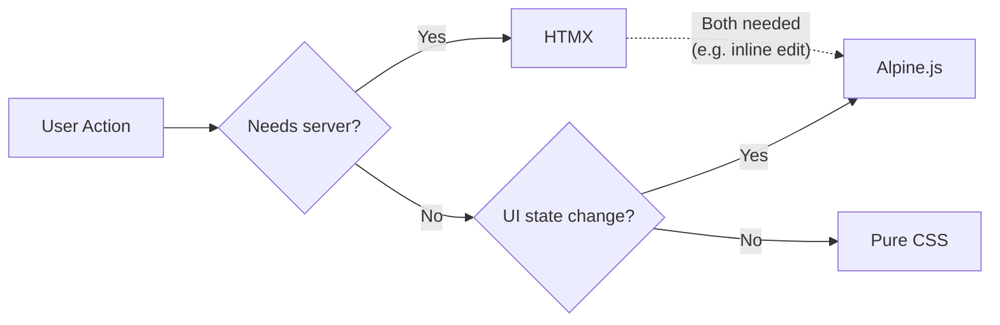

# gothic-to-do

A To-Do web application built with the GoTHIC stack. Minimal JavaScript, maximum server-side rendering.

> **[한국어 README](README_kr.md)**

## GoTHIC Stack

| Technology | Role |
|------------|------|
| **Go + Gin** | Web server, routing, middleware |
| **Templ** | Type-safe HTML template engine for Go |
| **HTMX** | AJAX requests & DOM swaps via HTML attributes |
| **Alpine.js** | Client-only state management (toggles, modals, etc.) |
| **TailwindCSS + DaisyUI** | Utility-first CSS + UI components |
| **air** | Go hot-reload |

Core idea: **The server renders HTML, and the browser displays it.** HTMX handles server communication, Alpine.js handles client-side interactions — responsibilities are clearly separated, so you rarely need to write JavaScript directly.

## Prerequisites

- **Go** 1.26+ (managed with asdf, see `.tool-versions`)
- **Node.js** 25+ / **npm** 11+ (managed with Volta, see `volta` section in `package.json`)
- **templ** CLI: `go install github.com/a-h/templ/cmd/templ@latest`
- **air**: `go install github.com/air-verse/air@latest`

## Project Structure

```
gothic-to-do/
├── cmd/server/main.go          # Entry point
├── internal/
│   ├── handler/todo.go         # Gin HTTP handlers
│   ├── model/todo.go           # Todo model
│   └── store/memory.go         # In-memory store
├── templates/
│   ├── layout.templ            # HTML layout (loads HTMX, Alpine.js via CDN)
│   ├── index.templ             # Main page
│   ├── todo_form.templ         # Input form + theme toggle (Alpine.js)
│   └── todo_list.templ         # Todo list/items (HTMX + Alpine.js)
├── static/css/
│   ├── input.css               # Tailwind input file
│   └── output.css              # Tailwind build output (gitignored)
├── air.toml                    # air configuration
└── Makefile                    # Dev/build commands
```

## Getting Started

```bash
# Go dependencies
go mod tidy

# Node dependencies (TailwindCSS + DaisyUI)
npm install

# Start dev server (air hot-reload + Tailwind watch)
make dev
```

Open http://localhost:8080 in your browser.

## When to Use HTMX vs Alpine.js



- **HTMX**: CRUD operations, form submissions — anything requiring server-side data changes
- **Alpine.js**: Theme toggle, inline edit mode — client-only UI state
- **Both**: Inline editing where UI switching (Alpine.js) + server persistence (HTMX) are both needed

## Commands

```bash
make dev          # Dev server (air + tailwind --watch)
make build        # Production build
make templ        # Run templ generate only
make css          # Run TailwindCSS build only (minified)
```
