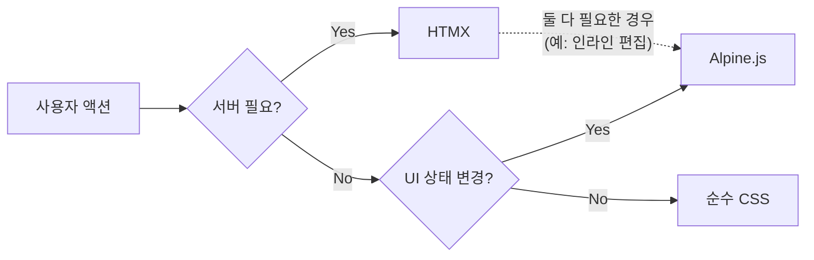

# gothic-to-do

GoTHIC 스택으로 만든 To-Do 웹 애플리케이션. JavaScript 로직을 최소화하고 서버 사이드 렌더링 중심으로 동작합니다.

## GoTHIC 스택

| 기술 | 역할 |
|------|------|
| **Go + Gin** | 웹 서버, 라우팅, 미들웨어 |
| **Templ** | Go 타입 안전 HTML 템플릿 엔진 |
| **HTMX** | HTML 속성만으로 AJAX 요청 및 DOM 교체 |
| **Alpine.js** | 클라이언트 전용 상태 관리 (토글, 모달 등) |
| **TailwindCSS + DaisyUI** | 유틸리티 퍼스트 CSS + UI 컴포넌트 |
| **air** | Go 핫 리로드 |

핵심 아이디어: **서버가 HTML을 렌더링하고, 브라우저는 그걸 잘 보여준다.** HTMX가 서버 통신을, Alpine.js가 클라이언트 인터랙션을 담당하며, 역할이 명확히 분리되어 JavaScript를 직접 작성할 일이 거의 없습니다.

## 사전 요구사항

- **Go** 1.26+ (asdf로 관리, `.tool-versions` 참조)
- **Node.js** 25+ / **npm** 11+ (Volta로 관리, `package.json`의 `volta` 섹션 참조)
- **templ** CLI: `go install github.com/a-h/templ/cmd/templ@latest`
- **air**: `go install github.com/air-verse/air@latest`

## 프로젝트 구조

```
gothic-to-do/
├── cmd/server/main.go          # 엔트리포인트
├── internal/
│   ├── handler/todo.go         # Gin HTTP 핸들러
│   ├── model/todo.go           # Todo 모델
│   └── store/memory.go         # 인메모리 스토어
├── templates/
│   ├── layout.templ            # HTML 레이아웃 (HTMX, Alpine.js CDN 로드)
│   ├── index.templ             # 메인 페이지
│   ├── todo_form.templ         # 입력 폼 + 테마 토글 (Alpine.js)
│   └── todo_list.templ         # 할일 목록/아이템 (HTMX + Alpine.js)
├── static/css/
│   ├── input.css               # Tailwind 입력 파일
│   └── output.css              # Tailwind 빌드 결과 (gitignore)
├── .air.toml                   # air 설정
├── tailwind.config.js          # TailwindCSS + DaisyUI 설정
└── Makefile                    # 개발/빌드 명령어
```

## 설치 및 실행

```bash
# Go 의존성
go mod tidy

# Node 의존성 (TailwindCSS + DaisyUI)
npm install

# 개발 서버 실행 (air 핫 리로드 + Tailwind watch)
make dev
```

브라우저에서 http://localhost:8080 접속.

## HTMX vs Alpine.js 사용 기준



- **HTMX**: CRUD 작업, 폼 제출 등 서버 데이터 변경이 필요한 경우
- **Alpine.js**: 테마 토글, 인라인 편집 모드 전환 등 클라이언트 전용 UI 상태
- **둘 다**: 인라인 편집처럼 UI 전환(Alpine.js) + 서버 저장(HTMX)이 모두 필요한 경우

## 주요 명령어

```bash
make dev          # 개발 서버 (air + tailwind --watch)
make build        # 프로덕션 빌드
make templ        # templ generate만 실행
make css          # TailwindCSS 빌드만 실행 (minify)
```
